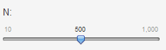
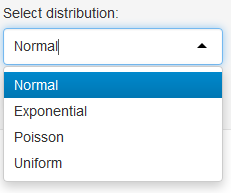
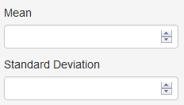

## Context

This App generates plots of simulated distributions using four common probability laws:

- Normal distribution
- Poisson distribution
- Exponential distribution
- Uniform distribution

This presentation will help you to use it in three steps.


## First Step

- Choose the sample size with the slide bar




- Choose the probability law




- Click on Submit button in the left panel


## Second Step

- Choose paremeters of the selected probability law




- Click on Submit button in the middle panel


## Final Step

- Enjoy

```{r, echo=FALSE}
hist(rnorm(1000, 0, 1))
```

## Download the code at...

http://www.github.com/trazom21/Shinyapp